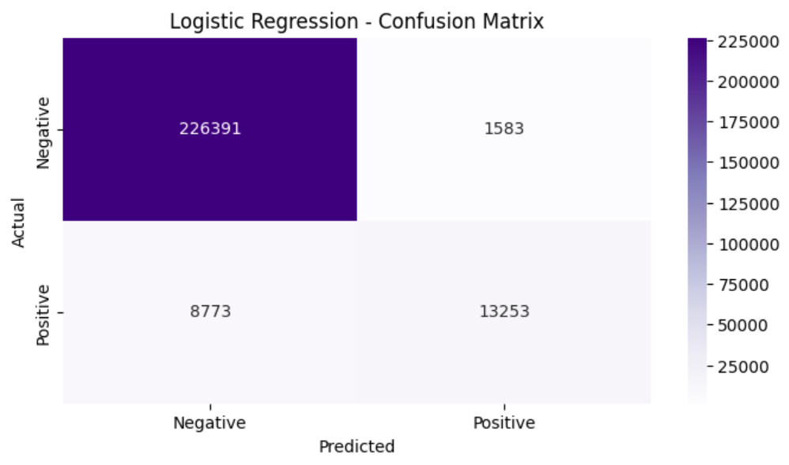
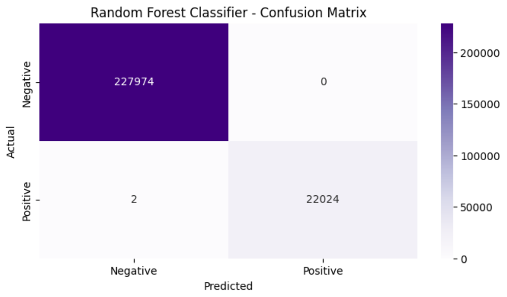
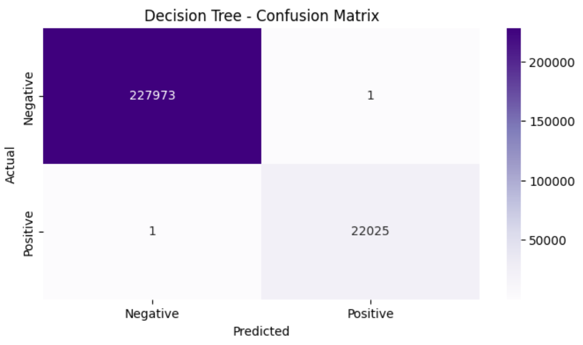
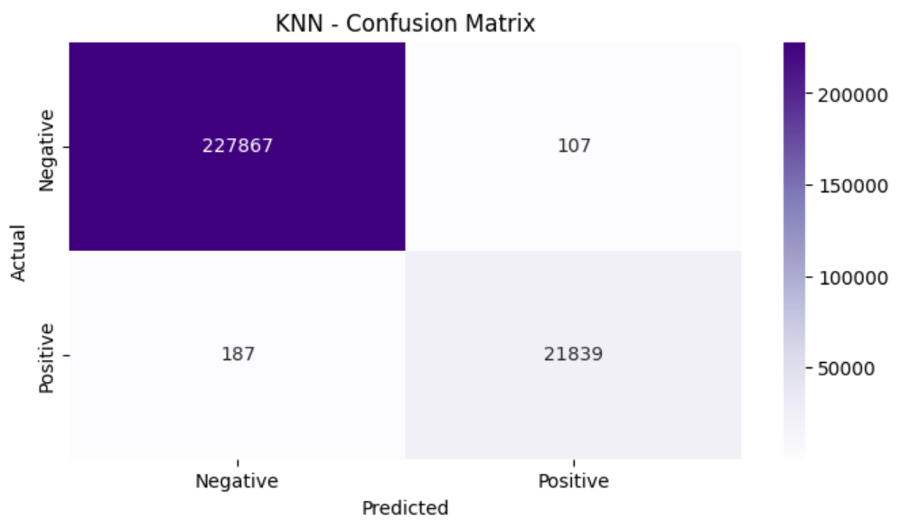

# Credit Card Fraud Analysis

## Table of Contents
- [Project Team](#Project-Team)
- [Summary](#Summary)
- [Research Questions](#Research-Questions)
- [Installation/Usage Instructions](#Installation/Usage-Instructions)
    - [Matplotlib](#Matplotlib)
    - [Pandas](#Pandas)
    - [NumPy](#NumPy)
    - [pydotplus](#pydotplus)
    - [Skitlearn](#Skitlearn)
    - [Running the Analysis](#Running-the-Analysis)
- [Overview](#Overview)
- [Approach](#Approach)
    - [Confusion Matrix](#Confusion-Matrix)
        - [Logistic Regression](#Logistic-Regression)
        - [Random Forest Classifier](#Random-Forest-Classifier)
        - [Decision Tree](#Decision-Tree)
        - [KNN](#KNN)
    - [Accuracy and R2 Comparison across 4 models](#Accuracy-and-R2-Comparison-across-4-models)
- [References](#References)

## Project Team
Vikram Borra, Larry Pavlik, Austin Cappetta, Justin Sansbury, Gabriel Jean-jumeau

## Summary
Our team, operating under the name FraudBusters, aims to conduct a comprehensive analysis and prediction of various types of fraudulent activities within a large-scale dataset of 10 million bank transaction records. By leveraging advanced data analytics and machine learning techniques, we seek to identify patterns and trends that characterize different fraud types within the database. Our objective is to categorize these fraud instances, develop predictive models for forecasting future fraudulent behavior, and continuously refine our approach for all four distinct categories of fraud present in the dataset. Through this process, we aim to provide actionable insights and enhance the detection and prevention of fraud in banking systems

## Research Questions
Can we predict the chance of fraud?

What is the most effective way of calculating the
probability of fraud?

## Installation/Usage Instructions 
To run the analysis and explore the dataset, you'll need the following Python libraries installed:

#### Matplotlib
For generating visualizations such as graphs and plots.

#### Pandas 
For handling data manipulation and analysis.

#### NumPy
For numerical operations, particularly for data cleaning and preprocessing.

#### pydotplus
For  Graphviz's Dot language.

#### Skitlearn 
For machine learning and modeling, is a open-source machine learning and modeling language.

#### Running the Analysis:
Download the necessary dataset (available on Kaggle or included in the repository).
Open the Jupyter notebook or Python script in the analysis/ directory.
Run the cells in sequence to perform the data analysis and for the ML functions

## Overview
This project successfully demonstrates the application of machine learning for fraud detection. By combining different models and optimizing them, we’ve developed a system that is not only accurate but also capable of handling complex, real-world transaction data. The combination of KNN, Decision Trees, Random Forest, and Logistic Regression, with optimization, has resulted in a powerful and scalable fraud detection tool.

## Approach 
In our fraud prediction project, we adopted a robust ensemble of machine learning models to deliver accurate and reliable results. We began by utilizing K-Nearest Neighbors (KNN) to classify transactions based on proximity, allowing us to capture patterns in data and identify potential fraud. We also employed a Decision Tree Model, which provides clear decision rules, helping us to interpret and understand the classification process. To further enhance prediction accuracy, we incorporated a Random Forest Classifier, an ensemble learning technique that combines multiple decision trees for a more robust and generalized prediction. Additionally, Logistic Regression was used to model the relationship between features and the likelihood of fraud, providing a probabilistic framework. To ensure optimal model performance, we performed Optimization techniques to fine-tune hyperparameters and achieve the best possible results. This comprehensive approach allowed us to leverage the strengths of each algorithm and deliver a strong, well-rounded fraud detection system.

### Confusion Matrix

#### Logistic Regression

<figure>
  
</figure> 

#### Random Forest Classifier

<figure>
  
</figure> 

#### Decision Tree

<figure>
  
</figure> 

#### KNN

<figure>
  
</figure> 

### Accuracy and R2 Comparison across 4 models
|                | Logistic Regression | Random Forest Classifier | Decision Tree      | K Neighbors Classifier (K=5) |
|----------------|----------------------|--------------------------|--------------------|-------------------------------|
| **Accuracy Score** |       0.95858       |         0.99999         |      0.99999      |            0.99882           |
| **Score**          |       0.95858       |         0.99999         |      0.99999      |            0.99882           |
| **R2**             |   0.48440  |    0.99990    | 0.99990 |       0.98536      |

## References:

- [data.openml.org](https://data.openml.org)

- [medium.com](https://medium.com/)

- [kaggle.com](http://kaggle.com/)

- [how-to-prevent-financial-fraud](https://freedomcu.org/financial-fraud/how-to-prevent-financial-fraud/)

- [protecting-yourself-from-criminals](https://www.aarp.org/money/scams-fraud/protecting-yourself-from-criminals/)

- [www.telusdigital.com](https://www.telusdigital.com/solutions/trust-safety-security/fraud-prevention-solutions?kw=fraud%20prevention%20support&cpn=436317468&&msclkid=cdac892e9f9b1cc8702aee8bc57356e1&utm_source=bing&utm_medium=cpc&utm_campaign=Trust%20%26%20Safety%3EFraud%20Prevention%3EPhrase&utm_term=fraud%20prevention%20support&utm_content=Fraud%20Prevention%20Support%20%7C%20Phrase&gclid=cdac892e9f9b1cc8702aee8bc57356e1&gclsrc=3p.ds)

- [www.top10.com](https://www.top10.com/id-theft/fraud-protection-comparison?bkw=fraud%20protection&bcampid=458203769&bcamp=IDT%20US%20Fraud%20Bing%20tCPA&bagid=1183076224435466&bag=Fraud%20protection&btarid=kwd-73942654354964:loc-4126&bidm=bp&bnet=o&bd=c&bmobval=0&bt=search&utm_source=bing&utm_medium=cpc&utm_term=tips%20to%20avoid%20fraud%202025&utm_campaign=Bing+CPC+Campaign&c=73942464302290&m=p&k=73942654354964&binterest=&bphysical=65542&bfeedid=&a=B249614&ts=&topic=&upf=&clicktype=&msclkid=9e57df6e12c919de027bb8cb4e5b9081)

- [fraud-prevention-tips](https://www.aura.com/learn/fraud-prevention-tips)

- [consumer.ftc.gov](https://consumer.ftc.gov/consumer-alerts/2024/12/stay-ahead-scammers-2025)
